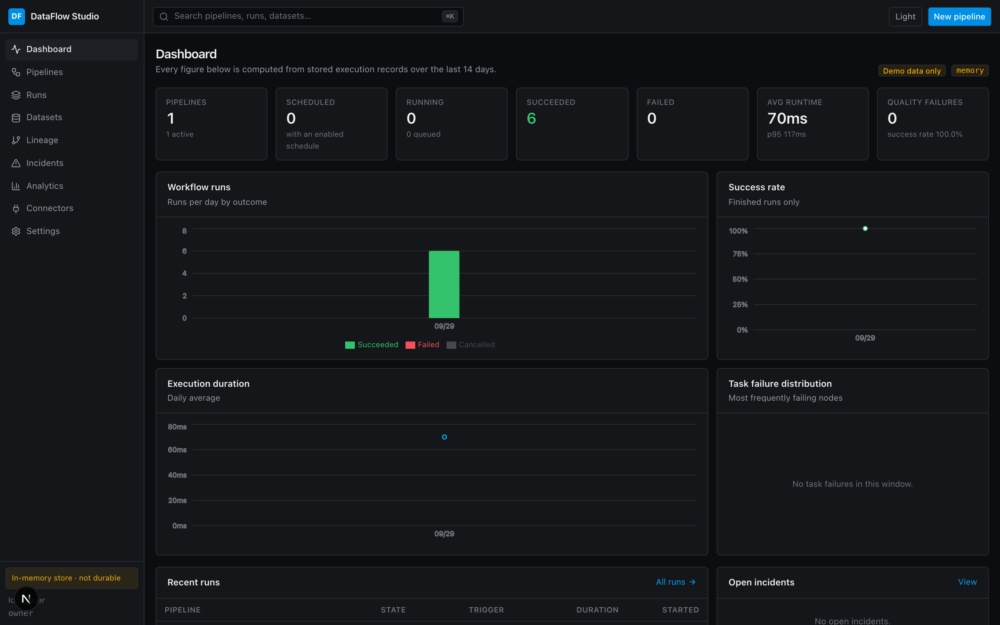
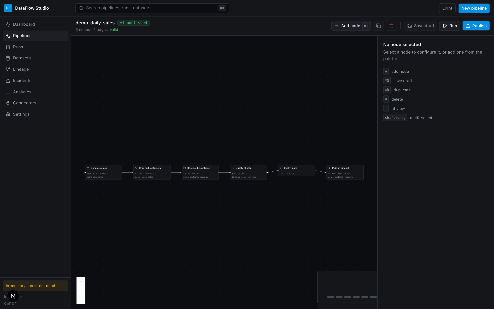
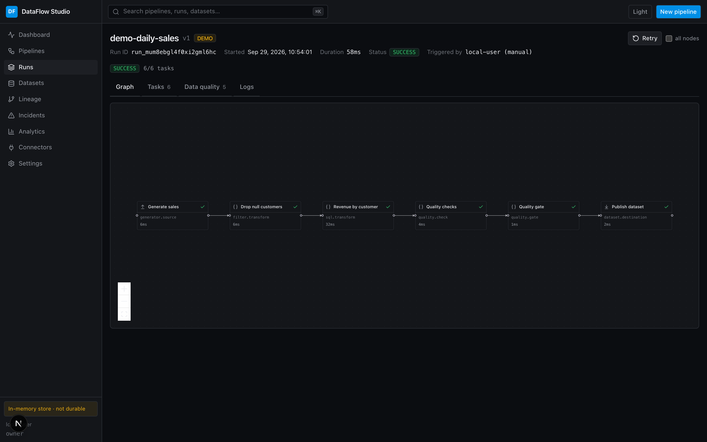
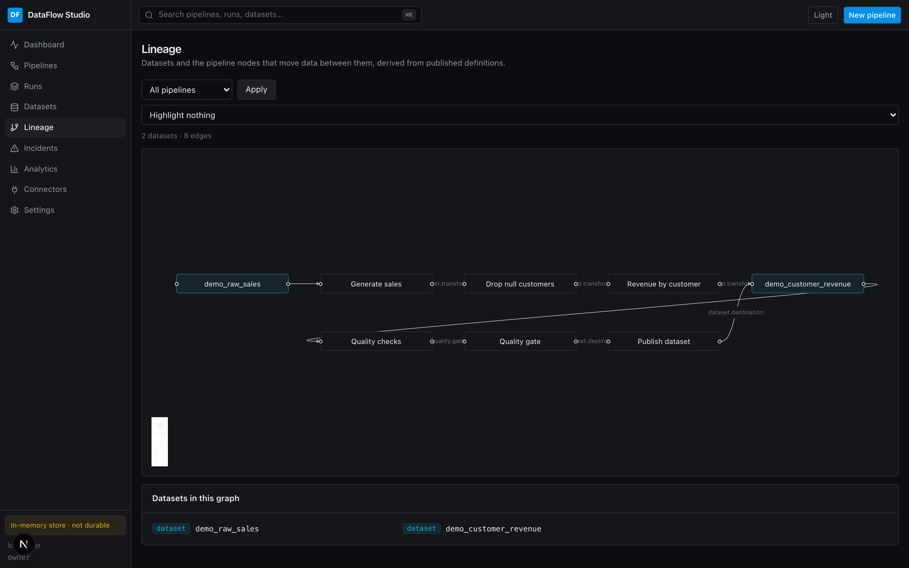
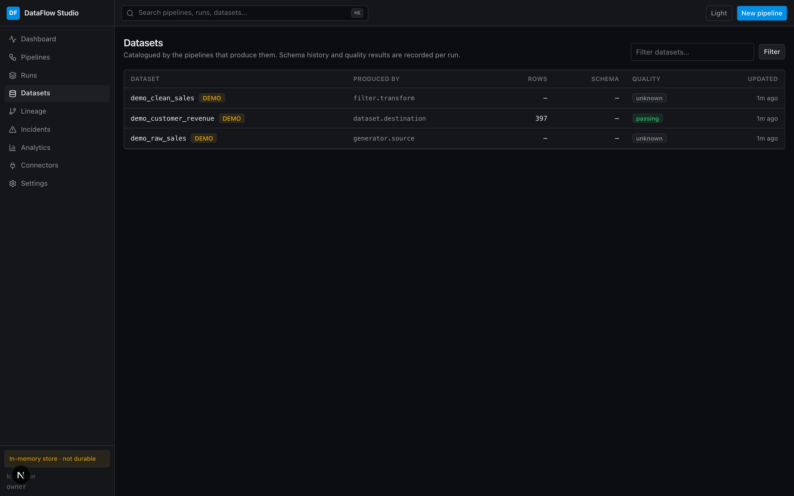

# DataFlow Studio

A control plane for data workflows: design pipelines visually, execute them on a
durable DAG engine, and find out what went wrong when they fail.

Open source (MIT). Runs on a laptop with no database, no queue and no accounts;
scales to a PostgreSQL cluster with independent workers without changing a line
of pipeline code.



---

## What it does

```text
Design → Validate → Version → Schedule → Execute → Observe → Debug → Retry / Backfill → Analyze
```

- **Visual DAG editor** with a node configuration form generated from the same
  schema the validator and the worker use, so the UI cannot drift from the engine.
- **Real execution engine**: lease-based task claiming, retries with backoff,
  cancellation that propagates, and recovery when a worker dies mid-task.
- **Quality gates that actually block.** A failing check marks the destination
  `BLOCKED` — the bad data never lands.
- **Schema tracking** with deterministic `COMPATIBLE` / `WARNING` / `BREAKING`
  classification of drift.
- **Lineage** derived from published definitions, with the gaps reported rather
  than guessed.
- **Incidents** opened from stored evidence: repeated failures, duration spikes,
  quality failures, schema drift, missing data, stale datasets.
- **REST API, TypeScript SDK and a CLI** that exits non-zero when a pipeline
  fails, so CI can gate on it.

## Quick start

```bash
git clone https://github.com/itsshreyasbhardwaj-design/dataflow-studio
cd dataflow-studio
pnpm install
pnpm run build:packages
pnpm dev
```

Open <http://localhost:3000> and press **Seed and run demo pipeline**. That
executes a real pipeline — generated source → filter → SQL aggregation → five
quality checks → quality gate → managed dataset — with no external systems
involved. Requires Node 20.11+ and pnpm 11; nothing else.

To point it at PostgreSQL, set `DATABASE_URL` and run `pnpm worker` alongside.
See [self-hosting](docs/self-hosting.md).

## Architecture

```text
              ┌──────────────────────────────────────┐
  browser ───▶│  web (Next.js)                       │
  CLI / SDK ─▶│    server components ─┐              │
              │    /api/v1/*  ────────┤              │
              │      apps/api: auth · RBAC · audit   │
              └───────────────┬──────────────────────┘
                              │
              ┌───────────────▼──────────────────────┐
              │  Store contract                      │
              │  in-memory  │  PostgreSQL            │
              └───────────────┬──────────────────────┘
                              │  claim · update · append
              ┌───────────────▼──────────────────────┐
  worker ×N ─▶│  execution engine                    │
              │  plan · run one task · advance run   │
              └───────────────┬──────────────────────┘
                              ▼
            connectors · transformations · data quality
```

The frontend never executes a workflow. A "Run" button creates rows; workers pick
them up. The browser learns what happened from a resumable event stream.

Two store drivers implement one contract and share one conformance suite, which
is why the in-memory driver is trustworthy rather than a toy: the engine cannot
tell them apart. Task claiming in PostgreSQL is a single
`UPDATE … FOR UPDATE SKIP LOCKED`, so N workers never collide, never block, and
need no broker or leader election.

Full detail in [`docs/architecture.md`](docs/architecture.md).

## The product

| | |
| --- | --- |
|  | **Visual editor.** React Flow canvas, Monaco for SQL and Python, configuration forms generated from the node registry, validation from the server rendered on the nodes themselves. |
|  | **Run view.** The executed DAG with per-node state, duration and row counts; tasks, attempts, quality results and searchable logs; live over server-sent events. |
|  | **Lineage.** Datasets and the nodes that move data between them, derived from published versions. Unresolved nodes are listed, never invented. |
|  | **Catalog.** Schema history with change classification, quality results over time, a bounded preview, and which pipeline produced it. |

## A pipeline

Definitions are JSON — the same thing the editor produces, `git diff` reads and
the CLI deploys:

```json
{
  "name": "daily-sales",
  "version": 3,
  "nodes": [
    { "id": "extract", "type": "postgres.source",
      "config": { "connectionId": "conn_123", "mode": "table", "table": "public.sales", "dataset": "raw_sales" } },
    { "id": "revenue", "type": "sql.transform",
      "config": { "query": "SELECT customer_id, SUM(amount) AS revenue FROM input GROUP BY customer_id",
                  "dataset": "customer_revenue" } },
    { "id": "quality", "type": "quality.check",
      "config": { "dataset": "customer_revenue", "checks": [
        { "id": "customer_id_unique", "type": "unique", "column": "customer_id" },
        { "id": "revenue_non_negative", "type": "range", "column": "revenue", "min": 0 }
      ] } },
    { "id": "gate", "type": "quality.gate", "config": { "severity": "any_failure" } },
    { "id": "load", "type": "postgres.destination",
      "config": { "connectionId": "conn_123", "table": "reporting.customer_revenue",
                  "writeMode": "upsert", "keyColumns": ["customer_id"], "idempotent": true } }
  ],
  "edges": [
    { "from": "extract", "to": "revenue" },
    { "from": "revenue", "to": "quality" },
    { "from": "quality", "to": "gate" },
    { "from": "gate", "to": "load" }
  ]
}
```

Validation catches the mistakes that otherwise surface at 02:14:

```text
Pipeline cannot run

Error [aggregate_sales]: Node "aggregate_sales" requires input from "clean_sales". The dependency is missing.
  Connect "clean_sales" to "aggregate_sales" with an edge, or point left at one of: customers.
```

## Features

<details>
<summary><b>Workflow engine</b></summary>

- Portable JSON definition; the node registry drives validation, the editor's
  forms and the docs from one declaration.
- DAG analysis: iterative cycle detection (no stack overflow on a 20k-node
  chain), topological layering, ancestors, descendants, connected components.
- Validation covering cycles, arity, disconnected nodes, duplicate IDs,
  unresolved cross-node references, missing credentials, unsupported connectors
  and every config field — with errors anchored to nodes and fields.
- Versioning: published versions are immutable; publishing deprecates the
  previous one in a transaction. A content hash ignores canvas positions, so
  moving a node is not a change.
- Retry policy with exponential, fixed and explicit backoff, error
  classification, and a refusal to retry non-idempotent destructive writes.
</details>

<details>
<summary><b>Execution</b></summary>

- Lease-based claiming with `FOR UPDATE SKIP LOCKED`; heterogeneous worker pools
  via `WORKER_NODE_TYPES`.
- Leases renewed on a heartbeat; a dead worker's tasks are reclaimed and re-run.
- Cancellation propagates to running tasks through an `AbortSignal`, and a run
  is only `CANCELLED` once every task is terminal.
- `advanceRun` is idempotent and cascades skips and blocks through the whole
  graph in one sweep.
- Retry-a-run creates a new run covering the failed nodes, their ancestors (for
  inputs) and their descendants — history is never rewritten.
</details>

<details>
<summary><b>Data</b></summary>

- **SQL engine** written for this project: tokenizer, Pratt parser, evaluator.
  Joins (hash where it can, nested loop otherwise), aggregates, `GROUP BY` /
  `HAVING`, `CASE`, `CAST`, `LIKE`/`ILIKE`, 30 scalar functions, three-valued
  logic and PostgreSQL null ordering. Transform SQL never reaches a database.
- **Quality**: eight check types with thresholds, severities and gates; results
  stored per run with real counts and sample values.
- **Schema registry**: type inference and profiling, versioned per dataset, with
  deterministic evolution rules — widening is compatible, dropping a column is
  breaking, relaxing nullability is a warning.
- **Connectors**: PostgreSQL, MySQL, HTTP, S3-compatible (SigV4 implemented
  directly, no vendor SDK), CSV, JSON, inline rows, deterministic generator.
</details>

<details>
<summary><b>Platform</b></summary>

- REST API with API-key and Clerk authentication, a four-role permission matrix
  enforced in the service layer, sliding-window rate limits, request IDs, audit
  logging and one error envelope.
- Server-sent events for live runs, resumable from the last sequence.
- PostgreSQL schema with foreign keys, partial indexes, a unique index that makes
  double-firing a schedule impossible, and optional row-level security.
- Cron and interval scheduling with explicit IANA timezones and correct DST
  behaviour; backfills with concurrency limits and guard rails.
- TypeScript SDK, `dataflow` CLI, and a worker with health and Prometheus
  endpoints.
</details>

## Local development

```bash
pnpm dev            # web + embedded worker (in-memory store)
pnpm worker         # standalone worker (requires DATABASE_URL)
pnpm seed           # demo pipelines, executed
pnpm test           # 729 unit and integration tests
pnpm test:e2e       # Playwright against a production build
pnpm lint           # ESLint
pnpm typecheck      # project-wide tsc -b
pnpm build          # packages + application
```

See [`docs/development.md`](docs/development.md).

## Environment

Everything is optional for local use. The ones that matter in production:

| Variable | Effect |
| --- | --- |
| `DATABASE_URL` | Switches to PostgreSQL. Without it, state is in memory and not durable. |
| `ENCRYPTION_KEY` | 32 bytes. Without it, only environment-injected secrets resolve. |
| `AUTH_MODE` | `clerk` or `local`. `local` is a single permitted user — development only. |
| `CONNECTOR_ALLOWED_HOSTS` | Restricts HTTP and object-storage nodes to known hosts. |
| `PYTHON_SANDBOX` | `disabled` (default) or `subprocess`. |
| `REDIS_URL` | Shares rate-limit counters between API instances. |
| `WORKER_CONCURRENCY`, `TASK_LEASE_SECONDS`, `WORKER_NODE_TYPES` | Worker behaviour. |

Full list with commentary in [`.env.example`](.env.example).

## Deployment

```text
users ──▶ web (N replicas) ──┐
                             ├──▶ PostgreSQL
          worker (M) ────────┘        └──▶ your data systems
```

Both tiers are stateless. Dockerfiles, a compose file, role grants, scaling
guidance and a troubleshooting table are in
[`docs/self-hosting.md`](docs/self-hosting.md).

## API, SDK and CLI

```bash
curl -H "Authorization: Bearer dfs_live_..." https://dataflow.example.com/api/v1/pipelines
```

```ts
const client = new DataFlowClient({ apiKey: process.env.DATAFLOW_API_KEY });
const run = await client.pipelines.run("pipe_123");
const finished = await client.runs.waitFor(run.id);
```

```bash
dataflow pipeline validate pipelines/daily-sales.json
dataflow pipeline deploy  pipelines/daily-sales.json --publish
dataflow pipeline run     daily-sales --wait          # exit 2 if the run fails
dataflow logs run_abc123 --follow
```

[API reference](docs/api.md) · [SDK](docs/sdk.md) · [CLI](docs/cli.md)

## Security

The properties the system is built to hold, each with adversarial tests:

- **A pipeline definition is untrusted input.** Identifiers are validated and
  quoted, not escaped; source queries must parse as a single `SELECT`; transform
  SQL never reaches a database.
- **A URL in a node is an SSRF attempt until proven otherwise.** DNS is resolved
  and every address range-checked; loopback, private, link-local
  (`169.254.169.254`), CGNAT and IPv6 equivalents are blocked; every redirect hop
  is re-validated.
- **Secrets are write-only over HTTP.** No endpoint returns a value. AES-256-GCM
  under a per-organization derived key, decrypted only in the worker, every read
  audited.
- **Logs are redacted at the sink**, so a connector that prints its own config
  cannot leak a credential.
- **User Python never runs in-process.** The default provider refuses; the
  subprocess provider is documented as suitable for single-tenant use only.
- **Tenancy is enforced in the persistence layer**, so a forgotten filter in a
  route handler cannot leak data.

[`docs/security.md`](docs/security.md) has the trust boundaries, the permission
matrix and a production checklist. Report vulnerabilities privately —
[SECURITY.md](SECURITY.md).

## Testing

| Suite | Count | What it covers |
| --- | --- | --- |
| Unit | 697 | SQL semantics, DAG algorithms, validation, retry planning, schema evolution, cron and DST, quality checks, encryption, SSRF policy, store conformance |
| Integration | 8 | The documented demo end to end through the HTTP handler and the worker's claim loop |
| Security | 24 | Cross-tenant access, SSRF, SQL injection, secret leakage, privilege escalation, resource exhaustion, RCE |
| E2E | 10 | The browser flow against a production build |

```bash
pnpm test                                      # unit + integration
TEST_DATABASE_URL=postgres://… pnpm vitest run packages/database   # the same
                                               # conformance suite against real PostgreSQL
```

CI runs lint, typecheck, tests, a PostgreSQL job, the E2E suite, a dependency
audit, a secret scan and CodeQL.

## Known limitations

Stated plainly, because a platform that hides these is harder to trust:

- **Intermediate data goes through the control plane.** Batches between tasks are
  stored as JSON with a 32 MB cap. That makes multi-worker execution correct for
  moderate volumes; it is not a shuffle engine. Large data should be written to a
  destination and read back — or pushed down into the source query.
- **The Python sandbox is not a security boundary.** `PYTHON_SANDBOX=subprocess`
  scrubs the environment and applies resource limits, which is enough for a
  single-tenant deployment. Multi-tenant deployments must supply a provider with
  real isolation; the interface exists for that.
- **The in-memory store is not durable and not shared.** It is the default for
  development and the E2E suite. The dashboard says so, and a detached worker
  refuses to start against it.
- **The AI features are absent, not stubbed.** The brief describes an optional
  debugging assistant and pipeline generator. The evidence-gathering they would
  consume is built and tested (`/api/v1/runs/:id/investigate`), but no model is
  wired up — the engine, scheduler and quality checks work identically without
  one, and shipping a placeholder that invents explanations would be worse than
  shipping nothing.
- **Connector coverage is deliberately narrow.** Six families, chosen to prove
  the abstraction. Snowflake, BigQuery, Kafka and MongoDB are not here; adding
  one is a registry entry, an executor and a `DataConnector`.
- **Column-level lineage is derived only for SQL transforms**, and `SELECT *` is
  reported as unresolved rather than expanded from a guess.
- **Turbopack prints "module not found" warnings** in development for `pg`,
  `mysql2` and `@clerk/nextjs`. Those are optional dependencies loaded through a
  dynamic import; the warnings are cosmetic and the production build is clean.
- **Single-region assumptions.** No multi-region coordination, no cross-cluster
  scheduling. The queue is a PostgreSQL table, with the durability and the
  throughput ceiling that implies.

## Contributing

[CONTRIBUTING.md](CONTRIBUTING.md) covers the layout, how to add a node type or a
connector, and what is expected of a test. The short version: a bug fix comes
with a test that fails without it, store changes run against both drivers, and
security-relevant changes get an adversarial test written as the attack.

## License

MIT — see [LICENSE](LICENSE).
